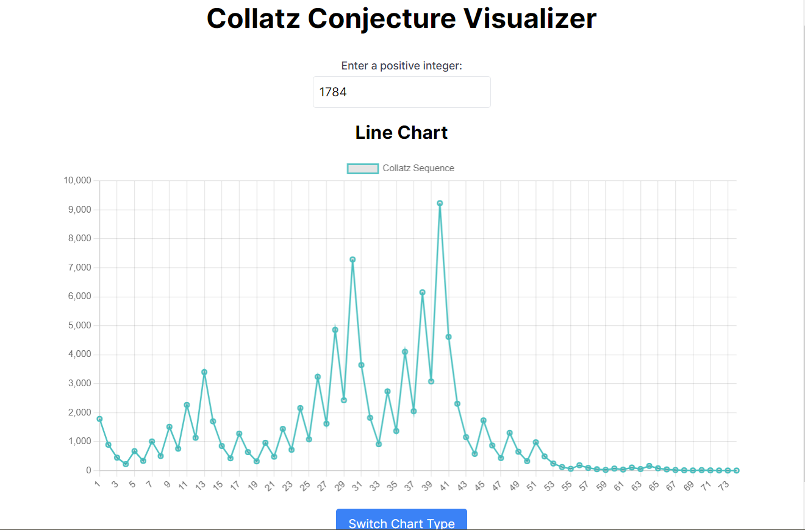

This is a [Next.js](https://nextjs.org/) project bootstrapped with [`create-next-app`](https://github.com/vercel/next.js/tree/canary/packages/create-next-app).

## Getting Started

Collatz Visualizer App Documentation
# Overview
Collatz Visualizer App is a web application that visualizes the Collatz sequence for a given positive integer. It leverages modern web technologies such as React.js, Next.js 14, and Chart.js. The app allows users to interactively explore the Collatz sequence through dynamic charts.

## Technologies Used
React.js: A JavaScript library for building user interfaces.
Next.js 14: A React framework for building server-rendered applications with improved developer experience.
Chart.js: A simple yet flexible JavaScript charting library for designers and developers.
Features

## Screenshots

### Line Chart


### Scatter Chart


# Collatz Sequence Calculation
Line Chart
The Line Chart visualizes the Collatz sequence straightforwardly.
The calculation involves repeatedly dividing the current number by 2 if it's even or multiplying it by 3 and adding 1 if it's odd.
The sequence is stored in an array, and the x-axis represents the steps in the sequence, while the y-axis represents the corresponding values.

# Scatter Chart
The Scatter Chart visualizes the Collatz sequence differently, with the x-axis representing the steps and the y-axis representing the length of the sequence.
Similar to the Line Chart, the calculation involves dividing by 2 if even and multiplying by 3 and adding 1 if odd.
Each point in the sequence is represented by an object with x and y coordinates for plotting.

# Collatz Sequence Visualization:

Users can input a positive integer.
The app dynamically calculates and visualizes the Collatz sequence for the given input.

# Interactive Charts:

Two types of charts are available: Line Chart and Scatter Chart.
Users can switch between the Line Chart and Scatter Chart to visualize the Collatz sequence in different ways.
Dynamic Chart Data Updates:

The chart data is updated dynamically as the user changes the input value.
Users can explore how the Collatz sequence changes with different input values.

# Chart Switching:

A button is provided to switch between Line Chart and Scatter Chart views.
This allows users to compare the visual representation of the Collatz sequence in different chart types.

# Usage
Input a positive integer in the provided field.
Explore the Collatz sequence in both Line Chart and Scatter Chart views.
Click the "Switch Chart" button to toggle between chart types.

First, run the development server:

```bash
npm run dev
# or
yarn dev
# or
pnpm dev
# or
bun dev
```

Open [http://localhost:3000](http://localhost:3000) with your browser to see the result.

You can start editing the page by modifying `app/page.js`. The page auto-updates as you edit the file.

This project uses [`next/font`](https://nextjs.org/docs/basic-features/font-optimization) to automatically optimize and load Inter, a custom Google Font.

## Learn More

To learn more about Next.js, take a look at the following resources:

- [Next.js Documentation](https://nextjs.org/docs) - learn about Next.js features and API.
- [Learn Next.js](https://nextjs.org/learn) - an interactive Next.js tutorial.

You can check out [the Next.js GitHub repository](https://github.com/vercel/next.js/) - your feedback and contributions are welcome!

## Deploy on Vercel

The easiest way to deploy your Next.js app is to use the [Vercel Platform](https://vercel.com/new?utm_medium=default-template&filter=next.js&utm_source=create-next-app&utm_campaign=create-next-app-readme) from the creators of Next.js.

Check out our [Next.js deployment documentation](https://nextjs.org/docs/deployment) for more details.
